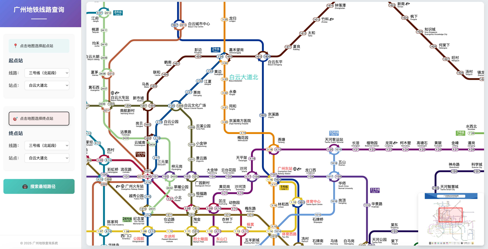

# 广州地铁线路查询系统

一个基于纯原生Web技术开发的广州地铁线路查询系统，提供直观的地图交互体验和最短路径查询功能。

最初用于提交数据结构课程作业，心血来潮重构后开源，可以通过[Github Page](https://xiaodcs.github.io/GuangzhouMetro/)访问。


## 功能特性

### 🚇 核心功能
- **最短路径查询**：使用Dijkstra算法计算站点间最优路线
- **地图交互选站**：直接点击SVG地图上的站点名称进行选择
- **实时路径高亮**：查询结果在地图上高亮显示
- **缩略图导航**：右下角缩略图帮助快速定位和浏览

### 🎨 界面特性
- **现代化设计**：采用渐变色彩和卡片式布局
- **响应式布局**：使用Flexbox适配不同屏幕尺寸
- **流畅动画**：按钮悬停、模态框弹出等交互动画
- **清晰的视觉层次**：左侧控制面板与右侧地图分离

## 技术架构

### 前端技术栈
- **HTML5**：语义化标签结构
- **CSS3**：Flexbox布局、CSS动画、渐变效果
- **原生JavaScript**：模块化代码组织
- **jQuery 2.2.2**：DOM操作和事件处理
- **svg-pan-zoom**：SVG地图缩放和平移
- **thumbnailViewer**：缩略图同步显示

### 项目结构
```
GuangzhouMetro/
├── index.html              # 主页面
├── metro.svg              # 广州地铁SVG地图
├── css/
│   └── modern-style.css   # 样式
├── js/
│   ├── modern-app.js      # 主应用逻辑
│   ├── gzmtr.js          # 地铁数据和算法
│   ├── jquery-2.2.2.min.js
│   ├── underscore-1.8.3.min.js
│   ├── svg-pan-zoom.js
│   └── thumbnailViewer.js
└── README.md             # 项目文档
```

## 使用指南

### 快速开始

1. **启动服务器**
   ```bash
   # Python 3
   python -m http.server 8000
   
   # 或使用 Node.js
   npx http-server -p 8000
   ```

2. **访问系统**
   打开浏览器访问 `http://localhost:8000`

### 操作流程



1. **选择起点站**
   - 点击左侧"点击地图选择起点站"提示
   - 在地图上点击站点名称
   - 或使用下拉菜单选择线路和站点


2. **选择终点站**
   - 系统自动切换到终点选择模式
   - 重复上述操作选择终点


3. **查询路线**
   - 点击"搜索最短路径"按钮
   - 查看弹出的详细路线信息
   - 地图上自动高亮显示路径

### 交互功能


- **地图缩放**：鼠标滚轮缩放，拖动平移
- **缩略图导航**：右下角显示全局视图
- **站点悬停**：鼠标悬停站点名称时变色放大

## 核心代码说明

### 数据结构
```javascript
// 站点定义
var station = new Terminal('站点名称');

// 线路定义
var line = new Line([station1, station2, ...], '线路名称');

// 地铁系统
var mtr = new MTR('广州地铁');
mtr.addLines([line1, line2, ...]);
```

### 算法实现
系统使用Dijkstra最短路径算法，考虑：
- 站点间距离（站数）
- 换乘成本（额外时间）
- 实际运行时间估算

### 界面布局
```css
/* Flexbox布局 */
.app-container {
    display: flex;
    height: 100vh;
}

.control-panel {
    width: 320px;  /* 固定宽度 */
}

.map-container {
    flex: 1;       /* 自适应剩余空间 */
}
```

## 浏览器兼容性

- Chrome 60+
- Firefox 55+
- Safari 11+
- Edge 79+

## 开发说明

### 修改站点数据
编辑 `js/modern-app.js` 中的 `initData()` 函数：
```javascript
// 添加新站点
var newStation = new Terminal('新站点');

// 添加到线路
lineTerminals.push(newStation);
```

### 自定义样式
主要样式文件：`css/modern-style.css`
- 颜色主题：渐变紫色头部，青绿色按钮
- 响应式断点：768px

### 调试技巧
1. 打开浏览器开发者工具
2. 在 Console 中查看日志输出
3. 使用 Network 面板确认 SVG 加载状态

## 项目特色

1. **纯原生实现**：不依赖大型框架，加载速度快
2. **模块化设计**：代码结构清晰，易于维护
3. **优雅降级**：移动端自动隐藏缩略图
4. **无障碍支持**：语义化HTML，键盘可访问

## 未来改进

- [ ] 添加实时地铁运营信息
- [ ] 支持多种路径规划策略（最快/最少换乘）
- [ ] 增加英文界面支持
- [ ] 优化移动端体验
- [ ] 添加线路拥挤度显示

## 开源协议

MIT License
